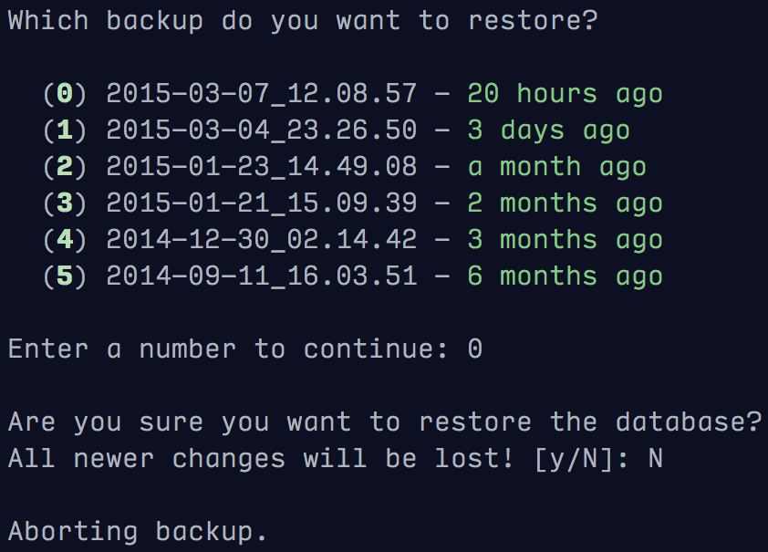

===============================
psql_backup
===============================

`psql_backup` provides a quick and dirty command-line
interface for backing up and restoring a PostgreSQL
database *en masse* from SQL dumps.

Features
--------

* Backup PostgreSQL database to dump files in an arbitrary directory
* Uses compressed PostgreSQL dump files
* Interfaces with Flask, with or without SQLAlchemy
* Uses the `click` command line interface library for easy extensibility

The CLI uses user-confirmation prompts to make sure you don't do anything
stupid.



Usage
-----

Install via `pip`:

```
> pip install git+git://github.com/davenquinn/psql_backup.git
```

The utility currently needs to be added to a larger CLI application
(a standalone script is a possibility for the future). Here's an
example of appending the `backup` and `restore` commands to a
`Flask-Migrate` database management command.

```python
from flask.ext.migrate import MigrateCommand
from psql_backup import PSQL_Backup

from .. import app

config = tuple(app.config.get(i)\
    for i in ("DB_NAME","DB_BACKUP_DIR"))
cmds = PSQL_Backup(*config)

MigrateCommand.command(cmds.backup)
MigrateCommand.command(cmds.restore)
```

Todo
----

* Add a standalone application (i.e. `psql_backup <dbname>`
  and `psql_backup restore <dbname>`)
* Add some way to prune old backups
* Add some tests
* Use something better than `shell=True` to write backups
* Maybe partial backups?
* Back up to a remote machine
