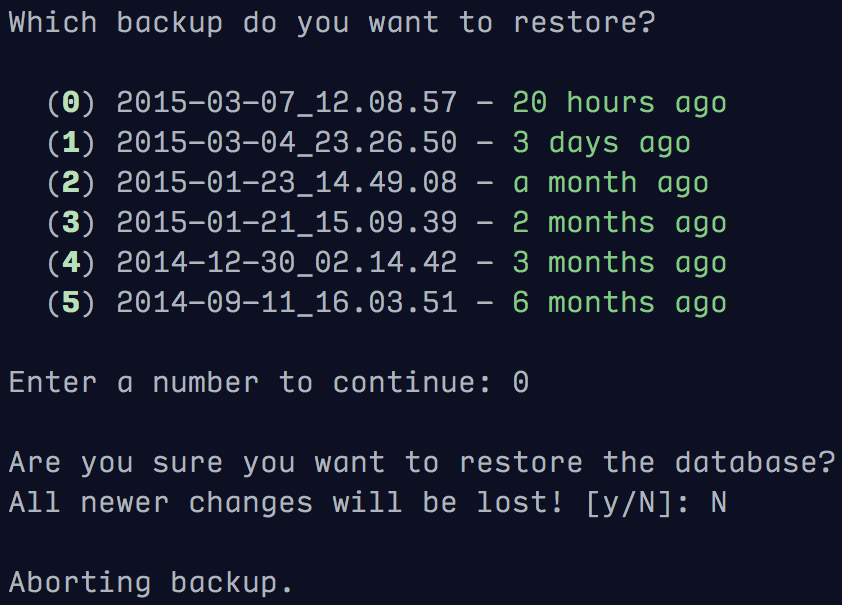

===============================
psql_backup
===============================

`psql_backup` provides a quick and dirty command-line
interface for backing up and restoring a PostgreSQL
database *en masse* from SQL dumps.

Features
--------

* Backup PostgreSQL database to dump files in an arbitrary directory
* Uses compressed PostgreSQL dump files
* Interfaces with Flask, with or without SQLAlchemy
* Uses the `click` command line interface library for easy extensibility

The CLI uses user-confirmation prompts to make sure you don't do anything
stupid.

Usage
-----

Install via `pip`

Todo
----

* Add a standalone application (i.e. `psql_backup <dbname>` and `psql_backup restore <dbname>`)
* Add some way to prune old backups
* Add some tests
* Use something better than `shell=True` to write backups
* Maybe partial backups?
* Back up to a remote machine
